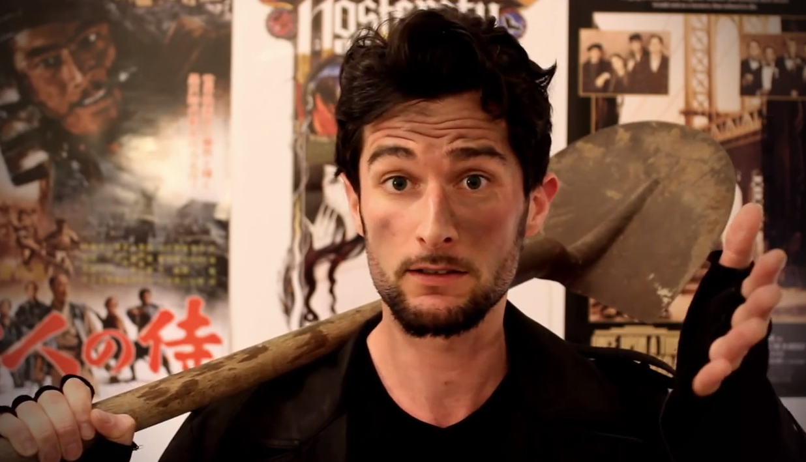

	<figure>
		
	</figure>	

	<section id="fiche-main">
  
		

			<h2>Fiche technique de la source</h2>
		
	

		
<strong> Source : </strong><a href="https://www.youtube.com/user/deadwattsofficiel">Voir la chaîne Youtube du Fossoyeur de Films</a>

	
		
<strong>Date de création :</strong> 2012

		
<strong>Nombres de vues : </strong> + 100 000

		
<strong>Rythme de publication :</strong> 1 par semaine.

	</section>

	<aside id="fiche-resume">
		

			<h2>Architecture du blog</h2>
			
Phasellus sodales erat quis erat tincidunt, a maximus dolor gravida. Fusce dapibus laoreet consectetur. Morbi placerat volutpat odio, suscipit imperdiet est commodo quis. Maecenas porttitor sapien malesuada orci convallis imperdiet. Sed ultrices nec turpis ac convallis. Praesent auctor orci mattis, ornare urna non, luctus metus. Nunc molestie imperdiet arcu et sollicitudin. Aenean ut tellus a est luctus semper eu eget nibh. Proin ante odio, aliquam a blandit et, molestie sed orci. Mauris hendrerit facilisis neque, a varius dui consequat sed. Pellentesque ullamcorper mattis lorem, nec placerat nulla euismod quis.

		

	 

	</aside>

	<aside id="fiche-tags">
		

			<h2>Thèmes / Catégories liés : </h2>
		
	
		

		<a href="#">cinéphilies</a>, <a href="#">histoire</a>, <a href="#">mesure de l’art</a>, <a href="#">plaisir</a>	
		

	</aside>

