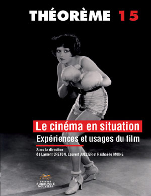

	<figure>
		
	</figure>	

	<section id="fiche-main">
  
		

			<h2>Informations Bibliographiques</h2>
		
	

		
<strong>Auteur(s) :</strong> Francesco Casetti

	
		
<strong>Date de publication :</strong> 2012

		
<strong>Revue / Journal : </strong> Théorème n°15, "Le cinéma en situations".

		
<strong>Collection : </strong> Pas pertinent ici.

		
<strong>Édité par : </strong>Presse de la Sorbonne Nouvelle
	

		
<strong>À :</strong> Paris

	</section>

	<aside id="fiche-resume">
		

			<h2>Détails sur le texte / ouvrage : </h2>
		

		

			Insérer texte résumé ici.
		
	
	 

	</aside>

	<aside id="fiche-tags">
		

			<h2>Thèmes / Catégories liés : </h2>
		
	
		

		<a href="#">cinéphilies</a>, <a href="#">histoire</a>, <a href="#">mesure de l’art</a>, <a href="#">plaisir</a>	
		

	</aside>

